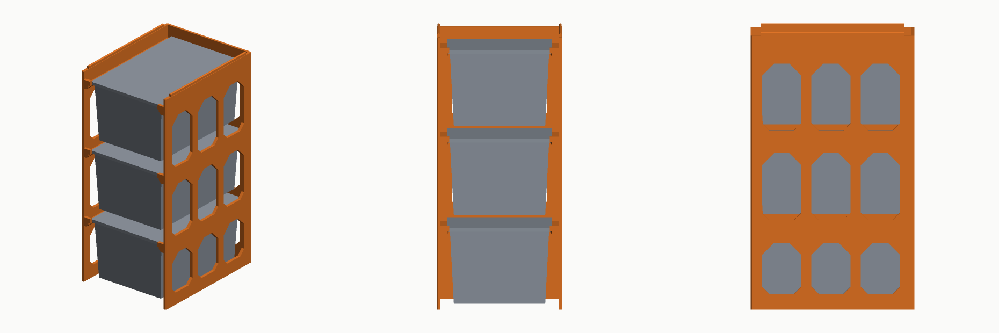
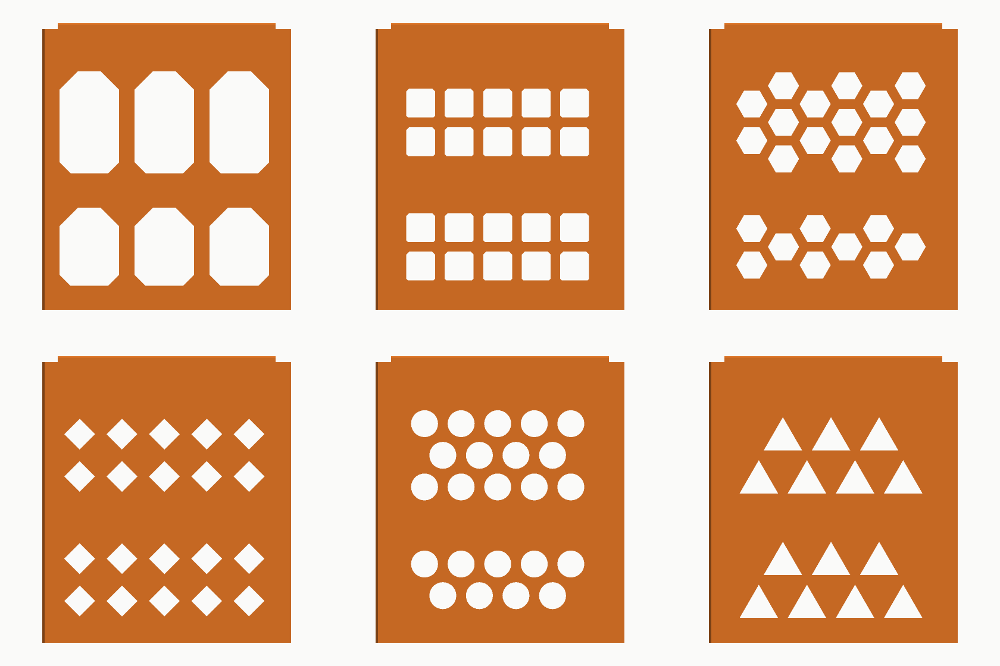
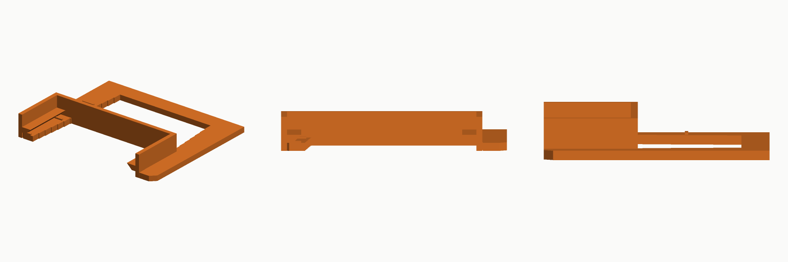

# storage-generator

Parametric generators for printable storage hardware. Each generator takes a
set of options, builds real solid geometry, and writes a run folder containing
STLs, a 3MF, a rendered preview, and the title and description that go with it.

First generator in the family: a **hanging bin rack** that carries tote bins by
their rims, built around the **GreenMade Mini Bin**.



## Quick start

```bash
pip install -r requirements.txt

PYTHONPATH=src python3 -m storagegen.cli list                 # what can it make
PYTHONPATH=src python3 -m storagegen.cli bins                 # what bins it knows
PYTHONPATH=src python3 -m storagegen.cli options bin-shelf    # every option

PYTHONPATH=src python3 -m storagegen.cli bin-shelf --out out
PYTHONPATH=src python3 -m storagegen.cli bin-shelf --columns 2 --rows 4 \
    --pattern honeycomb --front-stop label --base solid --out out
```

Installing the package (`pip install -e .`) puts a `storagegen` command on your
path and drops the `PYTHONPATH=src` prefix.

## What a run produces

Every run writes one folder under `out/`:

| File | What it is |
|---|---|
| `<part>.stl` | Binary STL per part, dropped onto Z=0 at the origin |
| `<slug>.3mf` | All parts in one file: millimetre units, named objects, laid out on the plate |
| `preview.png` | Three rendered views of what you print |
| `preview-in-use.png` | The same, with the bins it holds drawn in |
| `listing.md` | Title and full description: what it is, what it fits, dimensions, print notes, options used |
| `listing.json` | The same, structured |
| `manifest.json` | Every option, derived dimension, part size, warning, and a hash of the inputs |

Identical options produce byte-identical models, so a re-run only looks like a
change when something really changed.

## The bin rack

Each level is a pair of rails running front to back. The bin drops in between
them and stops when the flange around its rim lands on the rail tops, so it is
carried on its two long sides with nothing underneath it. Pulling a bin out is
a straight pull toward you.

The rail span is set from the bin's width *just below the rim*. Because the
bin's walls taper toward its base, the fit is self-correcting: a slightly wide
span lets the bin settle a millimetre until the taper wedges, a slightly narrow
one lets it ride on the rim, and either way it is carried down both sides.

It prints standing up in one piece with no support material. Rail undersides
are cut back at 45 degrees and the rail mouths flare open at the front so bins
guide themselves in.

## Patterns

Each of the four surfaces -- `sides`, `back`, `base`, `top` -- can be `open`,
`solid`, or `cut`. What gets cut into the ones set to `cut` is one option:

```bash
PYTHONPATH=src python3 -m storagegen.cli bin-shelf --pattern honeycomb --out out
PYTHONPATH=src python3 -m storagegen.cli bin-shelf --pattern diamond \
    --pattern-cell 12 --pattern-rib 4 --base cut --top cut --out out
```



`windows` (the default), `grid`, `honeycomb`, `diamond`, `round`, `triangle`.
Each brings its own sensible cell and web size, so switching pattern needs no
other change; `--pattern-cell` and `--pattern-rib` override them.

Every pattern is shaped so a vertical panel still prints without support:
hexagons sit flat-top rather than point-top, diamonds and triangles keep their
upper edges at 45 degrees or steeper, and square holes get their top corners
taken off so nothing bridges more than 12 mm. That rule is enforced by a test
that walks the outline of every cut-out rather than being left as a promise.

See [docs/bin-shelf.md](docs/bin-shelf.md) for the design in detail and
[docs/adding-a-generator.md](docs/adding-a-generator.md) for how to add the
next one.

## Fit: read this before printing a whole rack

The GreenMade Mini Bin's **outside dimensions are published** — 4.8 x 3.3 x
2.4 in — and the preset uses them. Its **rim overhang and wall draft are not
published anywhere**, so the preset uses typical values for a small moulded
tote (2.5 mm and 3 degrees). Those two numbers are what set the rail span.

The generator says so in every listing and manifest it writes, and there is a
second generator to replace the guess with a measurement:

```bash
PYTHONPATH=src python3 -m storagegen.cli fit-gauge --out out
```



It prints a stepped taper gauge in well under an hour. Push the bin into the
wide end until it stops; each step is 1 mm narrower than the last, so the step
it stops on is the measurement. Take it twice — once over the rim, once with
the gauge held flat against the underside of the rim — and half the difference
is the rim overhang. Then:

```bash
PYTHONPATH=src python3 -m storagegen.cli bin-shelf \
    --bin-width 84.0 --lip-overhang 2.8 --out out
```

Anything you measure yourself is recorded as measured rather than estimated,
all the way into the listing. The gauge also prints a short slice of the real
rack at the span your numbers imply, so you can feel the fit in ten minutes
instead of after a six-hour print.

## Fitting a different bin

Nothing is specific to one product. Override the six measurements that matter:

```bash
PYTHONPATH=src python3 -m storagegen.cli bin-shelf --bin generic-tote \
    --bin-length 150 --bin-width 100 --bin-height 75 \
    --lip-overhang 3 --lip-thickness 3 --bin-taper 3 --out out
```

A bin worth keeping belongs in `src/storagegen/presets.py`, where each
dimension records whether it came from a specification or an estimate.

## Building a batch in CI

Four commands cover it, and GitHub Actions just arranges them:

```bash
storagegen schema              # every variable, as JSON
storagegen plan                # what catalogue.json says to build
storagegen batch --chunk 0 --chunks 4 --out out
storagegen verify out          # re-read the written files and check them
```

`catalogue.json` lists the products worth building -- one-off `items`, and
`sweeps` that expand a few axes into every combination. Every variant is
validated against its generator's own option declaration when the catalogue is
read, so a typo fails in about a second rather than in two hundred build jobs.

`verify` reads the bytes back off disk and works out the topology from
scratch: edge use, winding, signed volume, connected components, declared
units, and agreement with `manifest.json`. It does not repair anything. A
model that fails is a bug upstream, and filling a hole automatically would
ship a shape nobody chose.

Two workflows: `ci.yml` (tests, then a smoke build and verify on every push)
and `catalogue.yml` (plan into a matrix, build the chunks in parallel, collect
and publish). Run the second from the Actions tab with a limit for "build me N
items", and optionally a tag to release under.

See [docs/pipeline.md](docs/pipeline.md) for the whole thing.

## Development

```bash
make test     # 141 tests, no network, a few seconds
make patterns # rebuild the pattern comparison image
make batch    # build the whole catalogue into out/
make verify   # check whatever is in out/
make demo     # build one of each into out/
```

The tests are worth a look before changing geometry. Beyond the usual unit
coverage they assert the things that are invisible in an STL and expensive on
the print bed:

- every option combination produces **one** connected watertight solid — the
  bug this catches is a rack that quietly prints as two loose halves
- the rack **clears** the bins it claims to hold, and dropping each bin 0.3 mm
  makes it collide, which is how you prove it is actually held up rather than
  floating in a hole
- a rack **stacked on itself** seats without its ribs fouling their sockets
- each step of the fit gauge really is the width it claims
- every cut-out is printable without support, checked edge by edge
- deliberately broken files -- truncated, holed, inside out, split in two --
  are each rejected with the right complaint
- the description never quotes a dimension the model does not have

## Roadmap

The rest of the family, in rough order:

- **Drawer organisers** in custom sizes, with dividers and options
- **Foldable bins**: two sides that lock in at the base and meet the other two
  as they pivot up
- **Tote box storage systems** built on the same rail idea at a larger scale
- Rack extras: tilted rails for pick-bin access, and a bolt-together split for
  racks taller than a print bed
