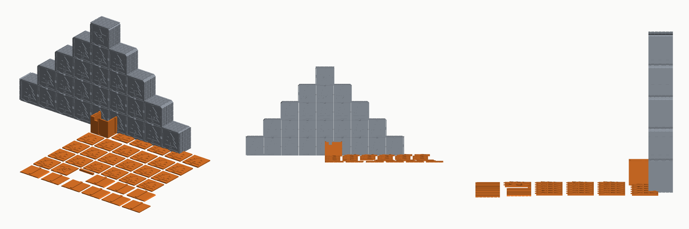
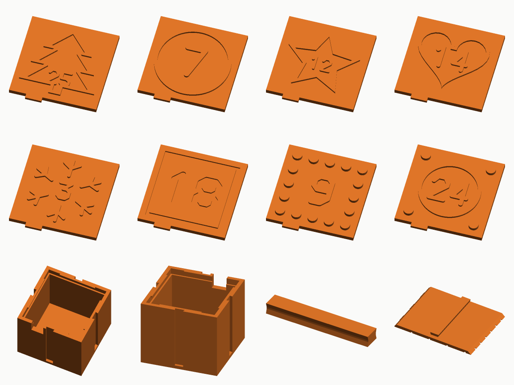

# The advent calendar

Numbered snap-lid boxes that clip together on every side into one calendar,
with flat panels for the outside so the finished thing shows no joints.



```bash
PYTHONPATH=src python3 -m storagegen.cli advent-calendar --out out
PYTHONPATH=src python3 -m storagegen.cli advent-calendar --numbering reversed \
    --frame star --lego yes --skin honeycomb --out out
PYTHONPATH=src python3 -m storagegen.cli advent-calendar --shape cylinder \
    --width 52 --frame snowflake --out out
```

## What a run makes

| Part | How many | Notes |
|---|---|---|
| `box` | one per day | Prints open side up |
| `lid-01` … `lid-25` | one each | The day's number, raised or recessed, inside a motif. Prints face up |
| `key` | one per joint | A double dovetail that joins two boxes. Prints flat |
| `skin-*` | one per outside face | Panels that hide the slots. Prints face down |

The default 25-day tree needs 36 keys and 28 panels: 114 parts in all, every
one of them flat on the bed with no supports.



## How the boxes join

Every side of every box has the same dovetail slot, open at the top and
closed just above the floor. Two boxes are joined by dropping a key -- a small
bow-tie -- into the pair of facing slots. Nothing is gendered: any side meets
any side, so the same box works in the middle of a row or at the tip of the
tree, and the arrangement is decided at assembly, not at print time.

A slot on the outside of the finished calendar takes a panel instead of a
key. The panel's back carries the same dovetail as the key's tail, so it slides
down the slot the same way, and its front is plain, brick, or one of the six
cut-out patterns pressed into it as shallow grooves.

Panel ends are cut for the corner they meet. At an outside corner two panels
run on past the box and meet at 45 degrees; at an inside corner -- a tree has
one at every step -- they are cut back to meet at 45 degrees the other way;
along a straight run they butt square. The generator reads the arrangement,
counts every outside face, decides which of the nine end combinations it
needs, and prints only those, with the right count of each.

## How the lid holds

The lid is a flat plate. It drops into the top of the box, past a short lip
on the inside of the rim, and lands on a ledge where the wall steps in. The
lip runs along the middle of each side only: that is where the walls can bow
a fraction to let the plate past, and at the corners, where they cannot,
there is no lip to get past. A tab on the front edge sits in a notch in the
rim so a small finger can pull the lid straight up.

A flat plate is the point of the design. A lid with a skirt underneath has to
print upside down, and then anything raised on top prints first, as loose
islands, with the whole lid bridged over them. A plate prints top-up, so the
number, the motif and the studs come out exactly as drawn.

## The number and the motif

There is no font here. The digits are ten polylines on a 10 x 16 grid drawn
with round-ended strokes, which is a few dozen lines of code rather than a
dependency and comes out looking like the numbers on a child's clock.

The motif is an outline round the number: `circle`, `square`, `star`, `tree`,
`heart`, or a `snowflake` drawn as strokes. It is sized to the lid by trying:
the generator draws it, checks whether every part of it lies inside the plate
with a margin, and shrinks it until it does -- because a motif that fits a
square lid by its bounding box puts its corners straight through a round or a
triangular one. On a tree arrangement the box at the tip gets a star.

`--number raised` stands 1 mm proud, which also makes it a grip;
`--number recessed` sinks 0.8 mm. A colour change at the height of the plate
puts a raised number in a second colour for free.

`--lego yes` adds Lego-compatible studs -- 4.8 mm on an 8 mm pitch -- in a
ring round the motif. The grid starts one stud in from the edge rather than
at the centre, so every lid gets its outer ring whatever its size.

## Shapes

`--shape box` (the default, `--width` by `--length`), `hexagon`, `triangle`
and `cylinder`. A cylinder has no flat side to put a slot in, so it grows four
small lugs at the quarters, each carrying a slot, and joins on a square grid
like a box. Hexagons and triangles tile in offset rows; the generator draws
them that way and includes one square-ended panel, but leaves the key and
panel counts to you, since they depend on how you put them together.

## Arrangements

`--arrangement tree` stacks rows of 1, 3, 5, 7, 9; `grid` finds the squarest
grid that divides the day count (24 is 4 by 6); `row` is a single line.
`--numbering ordered` reads top row first, `reversed` puts the last day at the
top -- where the tree has its star -- and `scattered` shuffles them the same
way every time for the same day count, so a reprint matches.

## Sizes worth knowing

The default box is 48 mm square by 40 mm tall, about 58 ml inside: a
chocolate, a small toy, a folded note. Below about 40 mm the number gets
small; the generator warns under 22 mm of lid. Boxes go up to 150 mm, which is
a calendar of small drawers.
