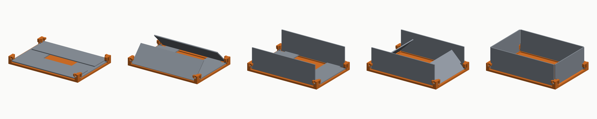

# The folding bin

A bin whose four walls pivot down flat onto its own floor. Five printed parts,
all flat on the bed, no supports, no fasteners: a base, two long walls, two
short ones.



## How the fold works

Every wall carries an eight-sided pin at each end that snaps into a socket in
a corner post. The two pairs pivot at **different heights**, one wall thickness
apart, so folded they stack rather than collide:

- the **short end walls** pivot low. They fold first, underneath.
- the **long side walls** pivot higher. They fold last, on top.

Erecting is that sequence run backwards -- the pair lying on top has to move
first -- so the side walls rise first and the end walls close last. That is why
the end walls are the pair that wraps the corners: they are the pair that
arrives last, when there is something to wrap around.

The end walls are also the pair that must fit *between* the erect side walls on
the way down, which is why they are shorter than the bin is deep. Above the
corner posts they widen back out into ears that close the corner the rest of
the way up; the ears start far enough out from the hinge to swing over the
posts rather than into them.

## Why the pins are not round

A wall prints lying flat, so its hinge axis lies **in the bed plane**. A round
pin is then a horizontal cylinder, and its underside is an overhang no slicer
prints cleanly without support.

An eight-sided pin has a flat first layer, a short bridge across the top, and
side faces no shallower than 45 degrees, so it prints unsupported. In a round
socket it turns on its corners with about 0.19 mm of wobble on a 5 mm pin.

| Facets | Shallowest face | Verdict |
|---|---|---|
| 6 | 60 degrees | Safest, roughest turn |
| 8 | 45 degrees | The default; right at the limit |
| 10 | 36 degrees | Needs support -- the generator says so |

The socket stays round, because a socket is a valley and valleys print fine.

## The base is carved by the motion

The interesting part of this generator is what it does *not* do. Nothing in the
base is dimensioned by hand to leave room for a wall. Instead the base is built
generously -- floor, rim all round, four corner posts -- and then each wall's
own cross-section is stamped through it at every angle it turns through, three
degrees apart, and subtracted.

What survives is by definition the material that is never in the way. A rim
that would foul a wall at 40 degrees is gone whether or not anybody thought
about 40 degrees.

Two consequences fall out of that for free:

- **Travel stops at square.** The sweep runs from flat to vertical and no
  further, so everything a wall would have to pass through to lean out any
  further is still standing. The stop lugs on the corner posts are simply
  material the sweep never reached.
- **Travel stops at flat, too.** Earlier versions swept a few degrees past flat
  for comfort; on a 60 mm wall six degrees is seven millimetres of drop at the
  tip, and it cut a trench clean through the floor. There is a test for it.

## What it gives up

- **Wall height is capped by the bin's own footprint.** Folded, each pair meets
  in the middle, so no wall can be longer than its half of the bin. The
  generator warns rather than building something that cannot close.
- **Folding needs more room than the bin occupies.** Each wall swings its
  bottom edge out as its top comes in. Without a flange the corner posts are
  padded out to cover that, so the folded bin stays inside its own outline;
  with a flange they are not, and the listing reports the clearance needed.
- **There is no hard stop against leaning inward.** The walls fold inward by
  design, so inward is the direction they are free to go. The end walls' ears
  bear on the side walls, and the contents do the rest.

## Hanging it on a rack

`--preset greenmade-rack` sizes the bin to hang from the same rails a GreenMade
Mini Bin hangs from: the body that passes between the rails and the flange that
lands on them both match the moulded bin, so it drops into a rack built for
that bin, in the same cell, at the same height.

```bash
PYTHONPATH=src python3 -m storagegen.cli folding-bin --preset greenmade-rack --out out
```

The walls come out shorter than the moulded bin's -- the fold limit above is
what does it -- and the listing says so rather than quietly delivering a
shallower bin.

`--rim-flange <mm>` does the same thing by hand at any size. The flange has to
stand proud of the corner posts to reach a rail, and the generator says so when
it does not.

## Options worth knowing

| Option | What it changes |
|---|---|
| `--preset` | `custom`, or `greenmade-rack` to hang on a bin rack |
| `--width --depth --height` | Inside dimensions |
| `--rim-flange` | Ledge round the top of the walls, for hanging |
| `--pivot-across --pivot-facets` | Pin size and how many sides it has |
| `--pivot-length --socket-wall --snap-grip` | How deep the pins go and how hard they clip |
| `--pattern` | Cut-outs through the walls and floor, same six as the rack |

## Assembly

1. Print the base once and each wall twice.
2. Hold a wall at about half travel, line its pins up with the angled entry in
   each corner post, and press down and in until they seat.
3. Raise the two long walls first, the two short ones after.

PETG rather than PLA: the pins take the load every time the bin folds, and PLA
is brittle at a hinge.
